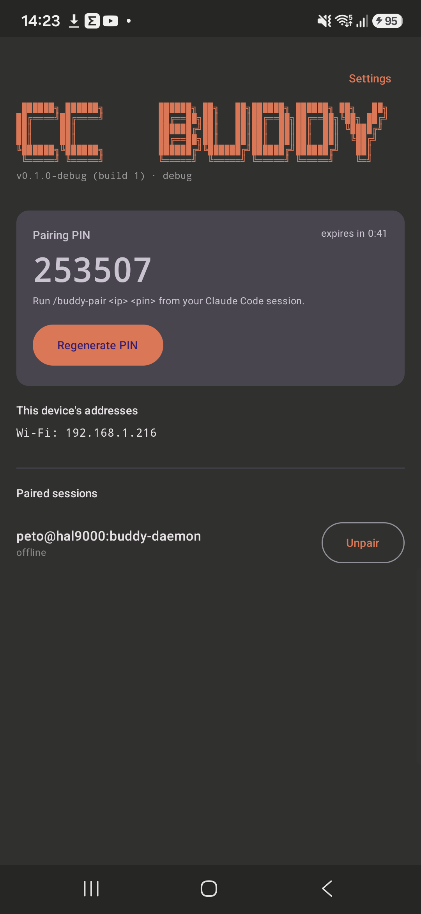
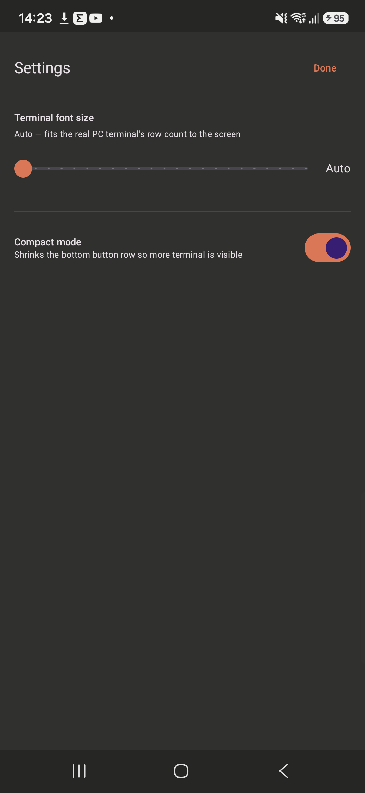
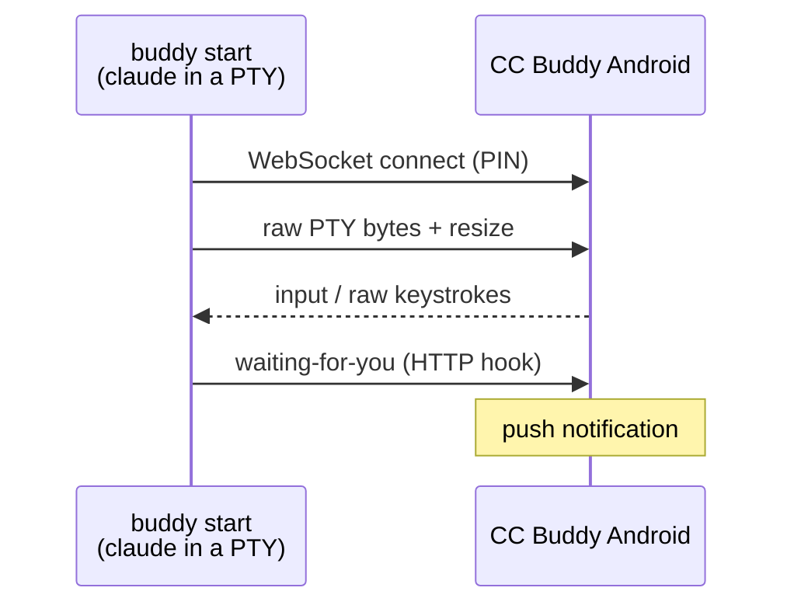

<div align="center">

# 📱 CC Buddy

Pair a Claude Code terminal session with your Android phone: live mirror, push notifications, and reply from the couch.

[](LICENSE)
[](buddy-daemon)
[](android)
[](buddy-plugin)

Claude Code keeps working on your machine. Your phone gets a live terminal, a nudge when it needs you, and a way to answer back — no cloud relay, no accounts, pairs directly over your LAN or Tailscale.

[Security](#security) · [Quick Start](#quick-start) · [How it works](#how-it-works) · [Commands](#commands) · [Manage your installation](#manage-your-installation) · [Build from source](#build-from-source)

</div>

<div align="center">
  
  
  <p><em>Pairing screen (PIN, addresses, paired sessions) and the settings screen (font size, compact mode).</em></p>
  <p><sub>⚠️ Screenshots predate v0.3.0 (TLS pairing, connection-quality indicator, TTS, dynamic quick-replies) — pending update.</sub></p>
</div>

## What You Get

- Wrap any `claude` session with `buddy start` — it behaves exactly like `claude`, nothing changes about how you work.
- Pair a phone by scanning the LAN (`/buddy-scan`) or typing an IP + 6-digit PIN (`/buddy-pair`), works over Wi-Fi or Tailscale. The connection is TLS-encrypted (`wss://`) end to end — see [Security](#security).
- Live, byte-exact terminal mirror on the phone (real xterm.js, not a screenshot) — sized to match your actual PTY so TUI redraws (box-drawing, scroll regions, status lines) render correctly.
- Push notification when Claude is waiting on you, cleared automatically once you're back. Optionally read the actual prompt (question + numbered options) aloud via text-to-speech — off by default, one tap to toggle from the terminal screen or Settings.
- Reply from the phone: dynamic quick-reply buttons that reflect whatever's actually on screen (a 5-way menu shows five buttons, not a fixed 1/2), a text field, or raw keystrokes (Tab, Page Up/Down, scroll wheel, Ctrl+O expand/collapse) sent straight into the PTY.
- Pair one phone with several PC sessions at once (and multiple phones with one session), switch between them from a single session list. A connection-quality indicator (round-trip latency, last-seen) is available in `/buddy-list` and, opt-in, on the phone's own list.
- A battery-optimization exemption prompt and a `connectedDevice`-type foreground service keep the connection alive in the background instead of getting killed to save power.
- Runs entirely on your LAN/Tailscale — the daemon only ever dials out to a phone IP you gave it; pairing tokens live in your OS keychain (`keytar` on the PC, `EncryptedSharedPreferences` on Android), not a plaintext file.

## Security

- **Transport**: the phone↔PC connection is `wss://` (TLS), not plaintext `ws://`. The phone generates a self-signed certificate on first run; the PC trusts it on first pairing (protected by the PIN + explicit accept-tap below) and pins its fingerprint for every reconnect after that — a cert that no longer matches is treated exactly like a rejected pairing token, not silently trusted.
- **Pairing**: a 6-digit, single-use PIN with a 2-minute TTL, plus an explicit accept/deny tap on the phone — no pairing completes without both. Wrong-PIN attempts are rate-limited (5 within 60s locks that source out for 30s) so the PIN can't be brute-forced at LAN speed.
- **Storage**: tokens live in your OS keychain (`keytar` on the PC, Android's `EncryptedSharedPreferences`) — never a plaintext file.
- **Network**: the daemon's control API binds `127.0.0.1` only; it never listens on the LAN. The phone's WS server does listen on the LAN (that's how pairing/mirroring works at all), but only accepts a connection that completes the PIN or token handshake.

## Quick Start

### 1. Clone and install

```bash
git clone https://github.com/naqoyqatsi83/cc-buddy.git
cd cc-buddy
./scripts/install.sh
```

Windows (PowerShell):

```powershell
git clone https://github.com/naqoyqatsi83/cc-buddy.git
cd cc-buddy
.\scripts\install.ps1
```

This builds the daemon, links a `buddy` command onto your `PATH`, and installs the `cc-buddy` Claude Code plugin (`/buddy-scan`, `/buddy-pair`, `/buddy-list`, `/buddy-unpair`). Restart any open Claude Code sessions afterward. Re-run the same command any time you `git pull` to update — see [Manage your installation](#manage-your-installation).

### 2. Start a paired session

```bash
buddy start --cwd /path/to/your/project
```

This behaves exactly like running `claude` directly — same session, same everything — but now `/buddy-*` commands work inside it.

### 3. Install the Android app

Grab the APK from [Releases](../../releases), or build it yourself:

```bash
cd android
./gradlew assembleDebug
adb install app/build/outputs/apk/debug/app-debug.apk
```

Open the app and grant the notification permission — it shows a 6-digit PIN and this phone's local IPs (Wi-Fi / Tailscale).

### 4. Pair

From the `buddy start` session on your PC:

```
/buddy-scan
/buddy-pair <ip> <pin>
```

A pairing request pops up on the phone — accept it, and the terminal mirror opens.

## How it works



The daemon spawns `claude` inside a real PTY sized to match your terminal, so anything the TUI does (scroll regions, absolute cursor addressing, box-drawing) mirrors byte-for-byte on the phone instead of reflowing or garbling. Claude Code's own HTTP hooks tell the daemon when a session is waiting on you; the daemon forwards that to every paired, connected phone as a real Android notification.

## Commands

| Command | What it does |
|---|---|
| `/buddy-scan` | Browse the LAN for phones advertising `_buddycc._tcp` (mDNS) |
| `/buddy-pair <ip> <pin>` | Pair with a phone by address and the PIN shown on its screen |
| `/buddy-list` | List phones paired to this session, with online/offline status, round-trip latency, and last-seen for offline peers |
| `/buddy-unpair [peer_id]` | Unpair a phone (prompts if more than one is paired) |

## Manage your installation

Re-run the installer any time — it's idempotent, and picks up whatever changed after a `git pull`:

```bash
git pull
./scripts/install.sh update      # or just: ./scripts/install.sh
```

To remove CC Buddy entirely (unlinks the `buddy` command, uninstalls the Claude Code plugin, deregisters the marketplace):

```bash
./scripts/install.sh uninstall
```

Windows: `.\scripts\install.ps1 update` / `.\scripts\install.ps1 uninstall`. Your local checkout isn't deleted by either script — remove the folder yourself if you're done with it.

## Build from source

<details>
<summary>Daemon only (no phone yet)</summary>

```bash
cd buddy-daemon
npm install
npm run build
node dist/cli.js start --cwd /path/to/your/project
```

This behaves exactly like running `claude` directly.
</details>

<details>
<summary>Android app</summary>

```bash
cd android
./gradlew assembleDebug
adb install app/build/outputs/apk/debug/app-debug.apk
```

Requires the Android SDK (platform 34, build-tools 34.0.0); `android/local.properties` (gitignored) should point at it.
</details>

## Project layout

- `buddy-daemon/` — Node.js/TypeScript daemon. `buddy start` wraps `claude` in a PTY (`node-pty`) and exposes a localhost-only control API used by the plugin commands and Claude Code's HTTP hooks.
- `buddy-plugin/` — Claude Code plugin providing `/buddy-scan`, `/buddy-pair`, `/buddy-list`, `/buddy-unpair`. Thin wrappers over the daemon's control API.
- `android/` — CC Buddy Android app (Kotlin + Jetpack Compose). Foreground service, embedded Ktor WebSocket server, PIN pairing handshake, paired-session list, and a live xterm.js terminal mirror with reply injection.
- `scripts/` — `install.sh` / `install.ps1`: install, update, and uninstall the daemon + Claude Code plugin.

## Credits

CC Buddy wasn't ported from anywhere — there's no original codebase behind it. Every line in `buddy-daemon/`, `android/`, and `buddy-plugin/` was designed, written, built, and debugged by Claude Code across a long pairing session with its one human collaborator.

🤖 No humans were harmed (or particularly involved) in the making of this app. The human's job was typing PINs, tapping Accept, occasionally saying "it froze" or "the text is cut off," and testing every feature live on a real phone before it shipped. Every fix, feature, and questionable design decision downstream of that was Claude's.

⚠️ No human has reviewed this code line by line. It's been *tested* for real — TLS pairing, reconnects, multi-session, rate limiting, the works, all verified live rather than just claimed — but tested and audited are different things. Treat it accordingly: reasonable for pairing your own phone to your own PC, not yet reasonable to bet anything sensitive on. 🤘

## License

MIT — see [LICENSE](LICENSE).
